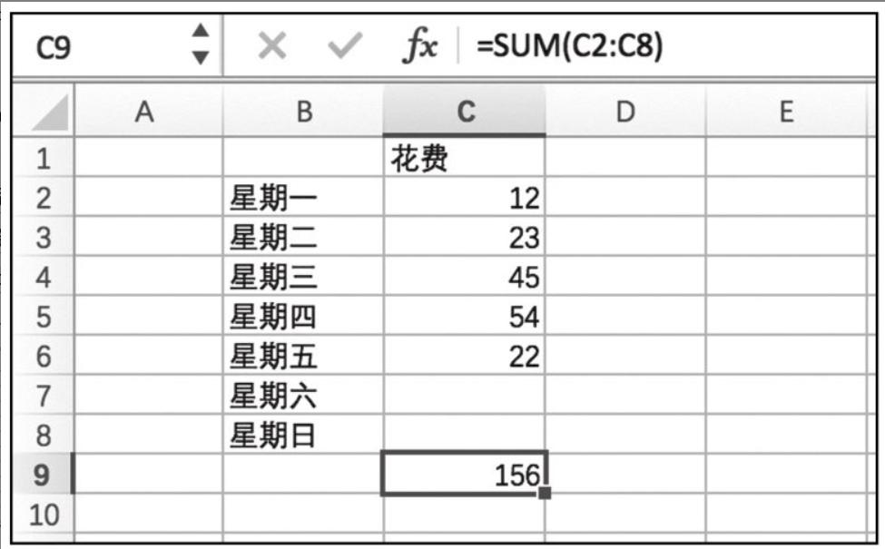

# 认识 Rxjs

## What is Rxjs? 它是什么？

Rxjs 全称是 Reactive Extensions for JavaScript。

拆解下，关键部分是 Reactive 和 Extensions。其中：

- Reactive 指的是 Reactive Programming 响应式编程;
- Extensions 指它是一种扩展机制。

### What is Reactive Programming? 什么是响应式编程？

Reactive Programming 响应式编程是一种编程范式，或者是一种编程风格，或者是一种编程思想。不要被“响应式”这个词吓到,其实这个概念并没有那么难理解。

如果你使用过 Excel 的公式功能，你就已经应用过响应式编程。下图演示使用 Excel 来统计多个格子中数据之和的功能，在 Excel 表格中，选中 C9 这个格子，在公式部分输入`=SUM(C2:C8)`，之后，无论我在 C2 到 C8 中填写什么数字，C9 这个格子里的数值都会自动更新为 C2 到 C8 所有格子的数值之和，换句话说，C9 能够对这些格子的数值变化作出“响应”​。



在这个 Excel 表格中，输入就是用户在 C2 到 C8 格子中填充的数值，用户这个填充动作是完全不可预料的，可能先填 C2，也可能先填 C5，用户还可能反复修改 C4 格子里的数值；用户可能每天填一个数字，也可能到星期天把 7 个格子一次填完……无论用户用何种方式操作，可以把操作看作是基于时间的一个动作序列，每次的操作动作都会产生一个数据，整个操作序列连续起来，像是会产生一个数据流，这个流中的一个元素，是对某个格子修改的的数值，然后不管你是顺序修改，还是隔天修改，或者间隔修改，这个程序都一视同仁，遵循同样的方式响应给 C9。

这个例子展示了响应式编程中的核心思想，就是把程序中的数据看作是一个可以被观察的序列，也可以称为数据流，其中数据的变化会被自动传播到所有依赖它的地方。

### What is Extensions? 什么是扩展机制？

目前社区中的各种编程语言，比如 `.Net / Java / C++ / Ruby / Python / JavaScript` 等等，并没有天生支持响应式编程，所以需要为这些语言增加一些功能扩展（Extension）来支持响应式编程。

Reactive Extensions 简称 Rx ，最初由微软公司实现并开源，也就是 Rx.NET，因为 Rx 带来的编程方式大大改进了异步编程模型，在.NET 之后，众多开发者在其他平台和语言上也实现了 Rx 的类库。可见，Rx 其实是一个大家族，在这个大家族中，还有用 Java 实现的 RxJava，用 C++实现的 RxCpp，用 Ruby 实现的 Rx.rb，用 Python 实现的 RxPy。包括这里介绍的 RxJS，就是 JavaScript 语言实现响应式编程的功能扩展库。

## Why Rxjs? 为什么要用 Rxjs？

在编程的世界中，程序中的数据，站在数据消费者的角度描述，无排就是两种方式，要么我主动获取，要么你主动推给我，就是所谓的**拉(pull)**或者**推(push)**。

> 正式一点解释就是：拉取和推送是两种不同的协议，用来描述数据生产者 (Producer)如何与数据消费者 (Consumer)进行通信的。

### 什么是拉取 Pull？

在拉取体系中，由消费者来决定何时从生产者那里接收数据。生产者本身不知道数据是何时交付到消费者手中的。

比如在 JavaScript 语言中，函数（Function）属于拉取体系。函数是数据的生产者，通过对函数进行调用“取出”一个返回值来对该数据进行消费。

```js
function add(a, b) {
  return a + b
  return a * 2 + b * 2 // 永远不会执行
}

// 调用 add 函数，返回一个值
const result = add(1, 2)
// 另一种调用方式
const result = add.call(null, 1, 2)
```

ES2015 引入了 generator 生成器函数 (function\*)，这是另外一种类型的拉取方式。调用后返回一个迭代器对象 iterator，可以多次调用它的 next 方法`iterator.next()`，“取出”多个返回值进行消费。

```js
function* add(a, b) {
  yield a + b
  yield a * 2 + b * 2
  yield a * 3 + b * 3
}
// 调用 add 函数，返回一个迭代器对象
const iterator = add(1, 2)
// 连续调用迭代器对象的 next 方法，返回一个对象
const result1 = iterator.next() // { value: 3, done: false }
const result2 = iterator.next() // { value: 6, done: false }
const result3 = iterator.next() // { value: 9, done: false }
const result4 = iterator.next() // { value: undefined, done: true }
```

### 什么是推送 Push？

在推送体系中，由生产者来决定何时把数据发送给消费者。消费者本身不知道何时会接收到数据。

在现代 JavaScript 语言中，Promises 属于推送体系类型。Promise(生产者) 将一个解析过的值传递给已注册的回调函数(消费者)，但不同于函数的是，由 Promise 来决定何时把值“推送”给回调函数。

但是，Promise 只能推送一个值，一旦一个 Promise 被 fulfilled 或者 rejected 之后，即使再次调用（then），获取到的仍是相同的值。

```js
const promise = new Promise((resolve, reject) => {
  resolve(1)
  // 这后面不会生效，因为已经 fulfilled 了
  resolve(2)
  resolve(3)
})

promise
  .then((value) => {
    console.log(value) // 1
  })
  .then((value) => {
    console.log(value) // 1
  })
```

所以在 JavaScript 语言中，缺少一个机制能够实现“推送”多个值，所以 Rxjs 应运而生，在 Rxjs 实现中 RxJS 引入了 Observable，一个新的 JavaScript 推送体系。Observable 是多个值的发布者，负责将值“推送”逐个推送给观察者(消费者)。

```js
import { Observable } from "rxjs"
const observable = new Observable((observer) => {
  observer.next(1)
  observer.next(2)
  observer.next(3)
})
observable.subscribe((value) => {
  console.log(value) // 1 2 3
})
```

### 总结

| 数据 data | 单个值   | 多个值               |
| --------- | -------- | -------------------- |
| 拉取 pull | Function | Generator / Iterator |
| 推送 push | Promise  | Observable           |

- Function 是惰性计算，调用时会同步地返回一个单一值。
- Generator 是惰性计算，调用时会同步地返回零到(有可能的)无限多个值。
- Promise 是立即计算，最终可能返回单个值，也可能不返回任何值。
- Observable 是惰性计算，它可以从它被调用的时刻起同步或异步地返回零到(有可能的)无限多个值。

> 惰性计算：指的是如果你不调用，它就不会执行。比如函数 Function 是在调用时才会执行计算，而不是在创建时就立即执行。Promise 就正好相反，它是在创建时就立即执行计算，而不是在调用时才执行。

### 应用场景

Rx（包括 RxJS）擅长处理异步操作，因为它对数据采用“推”的处理方式，当一个数据产生的时候，被推送给对应的处理函数，这个处理函数不用关心数据是同步产生的还是异步产生的，这样就把开发者从命令式异步处理的枷锁中解放了出来。

以前端领域的网页应用为例，网页 DOM 的事件，比如按钮的点击事件可以看作是一个无限的数据流，每点击一次会推送一个数据（事件对象）；通过 WebSocket 获得的服务器端推送消息可以看作是数据流；同样，通过 AJAX 获得服务器端的数据也可以看作是数据流，虽然这个数据流中可能只有一个数据；网页的动画显示当然更可以看作是一个数据流。正因为网页应用中众多问题其实就是数据流的问题，所以用 RxJS 来解决才如此得心应手。

但并不表示 Rx 不适合同步的数据处理，实际上，使用 RxJS 之后大部分代码不需要关心自己是被同步执行还是异步执行，所以处理起来会更加简单。

> 其实，RxJS 并不是专门用来解决异步问题的，它的出现只是为了更好地解决异步问题。RxJS 是一种响应式编程的库，它的核心思想是：把数据看作是一个可以被观察的序列或者数据流，其中数据的变化会被自动传播到所有依赖它的地方。

比如下面使用原生事件监听器实现的代码和使用 Rxjs 实现的代码，它们的功能是一样的，都是监听按钮的点击事件，进行计数。

```js
// 原生事件监听器
const btn = document.getElementById("btn")
let count = 0
btn.addEventListener("click", () => {
  count++
  console.log(count)
})

// Rxjs
import { fromEvent } from "rxjs"
const btn = document.getElementById("btn")
const count$ = fromEvent(btn, "click").pipe(scan((acc, _) => acc + 1, 0))
count$.subscribe((count) => console.log(count))
```

> 代表“流”的变量标示符，都是用`$`符号结尾，这是 RxJS 编程中普遍使用的风格，被称为“芬兰式命名法”​（FinnishNotation）​。

上面关于 rxjs 的代码，也许你现在还是一头雾水，但我们暂时可以不用纠结代码细节，仅阅读上面的 RxJS 代码，可以观察到一个有趣的现象：在使用原生事件监听器的实现中，我们有全局访问的变量`count`​，稍有不慎就会引发 bug；但是在 RxJS 实现中，没有这样存在隐患的变量，变量都收敛在单个处理函数的局部作用域中。

## Rxjs 的核心思想

函数式编程和响应式编程是 Rxjs 的两大核心思想。

### 什么是响应式编程？

响应式编程是一种编程范式，它将程序中的数据看作是一个可以被观察的序列，也可以称为数据流，其中数据的变化会被自动传播到所有依赖它的地方。
在 Rxjs 中，响应式编程是 Rxjs 的核心思想之一。

具体解释见上面的“什么是响应式编程？”​。

### 什么是函数式编程？

顾名思义，函数式编程就是非常强调使用函数来解决问题的一种编程方式。在 Rxjs 中，函数式编程是 Rxjs 的核心思想之一。

函数式编程的主要特点：

- 声明式 Declaration: 函数式编程的代码通常是声明式的，即代码描述了要做什么，而不是如何去做。
- 纯函数 Pure Function: 函数式编程中的函数是纯函数，即函数的返回值只依赖于函数的参数，不依赖于任何外部状态。
- 无副作用 No Side Effects: 函数式编程中的函数不能产生任何副作用，即函数不能修改外部状态，也不能调用任何可能产生副作用的函数。
- 不可变性 Immutability: 函数式编程中的数据是不可变的，即一旦创建就不能被修改。

> JavaScript 语言中函数有一等公民的特性，指的是函数可以作为参数传递给其他函数，也可以作为返回值返回。

#### 声明式 Declaration

和声明式相对应的编程方式叫做命令式编程（ImperativeProgramming）​，它用代码描述应该如何去做，而不是告诉应该做什么。

```js
function double(arr) {
  // 步骤1：创建一个新数组，用于存储结果
  const result = []
  // 步骤2：遍历数组，将每个元素乘以2，并将结果添加到新数组中
  for (let i = 0; i < arr.length; i++) {
    result.push(arr[i] * 2)
  }
  // 步骤3：返回新数组
  return result
}

function addOne(arr) {
  const result = []
  for (let i = 0; i < arr.length; i++) {
    result.push(arr[i] + 1)
  }
  return result
}
```

如果比较一下 double 和 addOne 这两个函数的代码，就会发现，除了函数名和 push 的参数之外，这两个函数如出一辙，简直就是一个模子里倒出来的。实际上，我在写 addOne 的时候，就是把 double 的代码拷贝过来，把函数名改为 addOne，然后把 push 的参数改为 arr[i]+1。
这种代码的问题在于，它的可读性很差，而且容易出错。如果我需要对数组中的每个元素执行其他操作，比如乘以 3、除以 2、取平方根等等，我就需要写很多类似的函数，这会导致代码重复，而且维护起来也很麻烦。

> 重复代码可能是所有软件中邪恶的根源

现在用函数式编程来重写上面的代码：

```js
function double(arr) {
  return arr.map((item) => item * 2)
}
function addOne(arr) {
  return arr.map((item) => item + 1)
}

// 如果用箭头函数来重写
const double = (arr) => arr.map((item) => item * 2)
const addOne = (arr) => arr.map((item) => item + 1)
```

现在，这两个函数的代码就非常简洁明了了，它们的功能是一样的，都是对数组中的每个元素执行相同的操作。
这种代码的优点在于，它的可读性很好，而且容易维护。如果我需要对数组中的每个元素执行其他操作，比如乘以 3、除以 2、取平方根等等，我只需要修改 map 函数的参数即可。

也就是说只需要告诉我你要做什么的函数作为入参就可以了，由程序封装了怎么去做的逻辑。声明式编程抽象了代码的细节，可以认为声明式编程解决了命令式编程重复代码的问题。

#### 纯函数 Pure Function

所谓纯函数，指的是满足下面两个条件的函数。

- 函数的执行过程完全由输入参数决定，不会受除参数之外的任何数据影响。
- 函数不会修改任何外部状态，比如修改全局变量或传入的参数对象。

所以可以认为纯函数做的事情就是输入参数到返回结果的一个映射，不会产生副作用（Side Effect）​。与之相对的就是“不纯函数”​（Impure Function）​，一个函数之所以不纯，可能做了下面这些事情：

- 改变全局变量的值。
- 改变输入参数引用的对象
- 读取了外部状态，或者网络输入等。
- 抛出了异常

纯函数是(Pure Function)通常也是无副作用的 (No Side Effects)。

#### 不可变性 Immutability

不可变性 Immutability 是指数据一旦创建就不能被修改，任何修改都会返回一个新的对象。

对于刚刚接触这个概念时候，可能会觉得莫名其妙，因为程序就是用代码指令在操作数据，如果数据不能变化，那一个程序又能够干什么有用的事情？

程序要好发挥作用当然是要产生变化的数据，但是并不意味着必须要去修改现有数据，更好的方法是通过产生新的数据，来实现这种“变化”​，也就是说，当我们需要数据状态发生改变时，保持原有数据不变，产生一个新的数据来体现这种变化。

不可改变的数据就是 Immutable 数据，它一旦产生，我们就可以肯定它的值永远不会变，这非常有利于代码的理解。

在 JavaScript 语言中，字符串类型、数字类型就是不可改变的数据。使用这两种类型的数据给你带来的麻烦比较少。相反，JavaScript 中大部分对象都是可变的，比如数组 array 的 push、pop、sort 方法都会改变一个数组的原有的内容，所以在最新的 Js 规范中引入了不可变性的方法 with、toSorted、toSpliced 等方法。

```js
const arr = [1, 2, 3]
arr.push(4)
console.log(arr) // [1, 2, 3, 4]

const newArr = arr.with(1, 5) // 方法是返回一个新的数组，不会改变原有的数组
console.log(newArr) // [1, 5, 3]
console.log(arr) // [1, 2, 3]
```

另外，要注意 JavaScript 中的 const 关键字虽然有常数（constant）的意思，但其实只是规定一个变量引用对象的地址不能改变，却没有规定这个 const 变量引用的对象自身不能发生改变，所以，这个“常量”依然是变量。

```js
const a = "immutable"
a = "mutable" // 报错，因为 a 是一个常量，不能重新赋值
const b = [1, 2, 3] // b 实际赋值的是一个数组的引用地址，这个引用地址不能改变，但是数组本身是可变的
b.push(4) // 不会报错
const obj = {
  // obj 实际赋值的是一个对象的引用地址，这个引用地址不能改变，但是对象本身是可变的
  name: "immutable",
  age: 18,
}
obj.name = "mutable"
obj.age = 20
obj = {
  name: "mutable",
  age: 20,
}
```

### 什么是面向对象编程

通过与函数式编程作为对比的是面向对象编程。面向对象编程是一种编程范式，它将程序中的数据看作是一个对象，对象有属性和方法。对象的属性和方法可以被其他对象访问和修改。

- 面向对象编程三大特征：封装、继承、多态。
- 函数式编程三大特征：声明式、纯函数、不可变性。

为了避免命令式编程中数据的随意修改容易产生问题，面向对象的思想是把数据封装在类的实例对象中，把数据藏起来，让外部不能直接操作这些对象，只能通过类自身提供的实例方法来读取和修改这些数据，这样就限制了对数据的访问方式。而函数式编程则是尽量减少不去改变数量，通过创建新数据，来减少问题。

> 面向对象是把数据变化封装在内部，函数式编程是不去改变原数据，以减少不确定性带来程序的影响。

## Rxjs 的实现基础

Rxjs 是基于观察者模式和迭代器模式实现的。所以先理解下这两种设计模式。

> 设计模式，指的都是解决某一个特定类型问题的套路和方法。

现实世界的问题复杂多变，往往不是靠单独一种模式能够解决的，更需要的是多种模式的组合，RxJS 实现的就是观察者模式和迭代器模式的组合。

> 设计模式的基本思想是：分而治之的思想，就是把一个复杂的问题分解成多个简单的问题，然后再把多个简单的问题组合起来解决复杂的问题。把耦合的代码解耦，让代码更加灵活、可扩展、可维护。通常“分”很容易，关键是“治”（如何治理，让已分开的各部分保持联系）。

### 什么是观察者模式？

观察者模式，也称为发布订阅模式。它解决的是存在一对多的依赖关系的问题，在逻辑上将耦合的部分分成发布者（Publisher）和观察者（Observer），其中发布者只管负责产生事件，并通知所有已订阅的观察者，而不用去关心这些观察者如何处理这些事件，相对的，观察者通过订阅某个发布者，只管接收到事件，然后进行处理，而不关心这些事件是如何产生的。

```
                   订阅
+-----------+     subscribe    +-----------+
|           | <--------------+ |           |
| 发布者     |                  | 观察者     |
| Publisher |                  | Observer  |
|           | +--------------> |           |
+-----------+     publish      +-----------+
                   发布
```

简单示例

```js
// 定义发布者类
class Publisher {
  constructor() {
    // 存储所有订阅者的数组
    this.observers = []
  }

  // 订阅方法，用于添加观察者到订阅者列表
  subscribe(observer) {
    this.observers.push(observer)
  }

  // 取消订阅方法，用于从订阅者列表中移除观察者
  unsubscribe(observer) {
    this.observers = this.observers.filter((obs) => obs !== observer)
  }

  // 发布通知方法，用于通知所有订阅者
  notify(data) {
    this.observers.forEach((observer) => observer.receive(data))
  }
}

// 定义观察者类
class Observer {
  constructor(name) {
    // 观察者的名称
    this.name = name
  }

  // 接收发布者的通知并处理数据
  receive(data) {
    console.log(`${this.name} 接收到数据: ${data}`)
  }
}

// 使用示例
const publisher = new Publisher()

// 创建两个观察者实例
const observer1 = new Observer("观察者1")
const observer2 = new Observer("观察者2")

// 观察者订阅发布者
publisher.subscribe(observer1)
publisher.subscribe(observer2)

// 发布者发布通知
publisher.notify("新消息")

// 观察者1取消订阅
publisher.unsubscribe(observer1)

// 发布者再次发布通知
publisher.notify("另一条新消息")
```

### 什么是迭代器？

迭代器模式的主要思想是：把聚合对象的遍历操作从聚合对象中分离出来，放到一个迭代器对象中，使得聚合对象可以独立于迭代操作进行变化。

数据集合的实现方式很多，可以是一个数组，也可以是一个树形结构，也可以是一个单向链表等等。而迭代器的作用就是约定一个通用的接口，可以顺序访问一个聚合对象中的各个元素，而又不需要暴露该对象的内部表示，也让使用者完全不用关心这个数据集合的具体实现方式。

迭代者（Iterator，也称为“迭代器”​）指的是能够遍历一个数据集合的对象，它提供了一种顺序访问数据集合元素的方式，比如调用 `iterator.next()`方法获取值。

迭代器的实现方式很多，但不管对应函数如何命名，通常都会包含实现以下功能的方法：

- `next()`：返回一个对象，包含两个属性：`value`和`done`，`value`是当前迭代的值，`done`是一个布尔值，表示是否还有更多的元素可以迭代。
- `hasNext()`：返回一个布尔值，表示是否还有更多的元素可以迭代。
- `current()`：返回当前迭代的值。

```
+-----------------+
|                 |
|  聚合对象        |
|                 |
+-----------------+
        |
        |
        v
+-----------------+
|                 |
|  迭代器对象      |
|                 |
+-----------------+
```

简单示例

```js
// 定义迭代器类
class Iterator {
  constructor(data) {
    // 存储要迭代的数据
    this.data = data
    // 当前迭代的索引
    this.index = 0
  }
  // 检查是否还有下一个元素

  hasNext() {
    return this.index < this.data.length
  }
  // 获取下一个元素
  next() {
    if (this.hasNext()) {
      return { value: this.data[this.index++], done: false }
    }
    return { value: null, done: true }
  },
  // 获取当前元素
  current() {
    return this.data[this.index]
  }
}
// 使用示例
const data = [1, 2, 3, 4, 5]
const iterator = new Iterator(data)
while (iterator.hasNext()) {
  iterator.next()
  console.log(iterator.current())
}
// 输出：1 2 3 4 5
```

## 总结

Reactive Extension 结合了 观察者模式、迭代器模式， 以及使用函数式和声明式的编程，来解决异步事件管理的语言扩展库。
